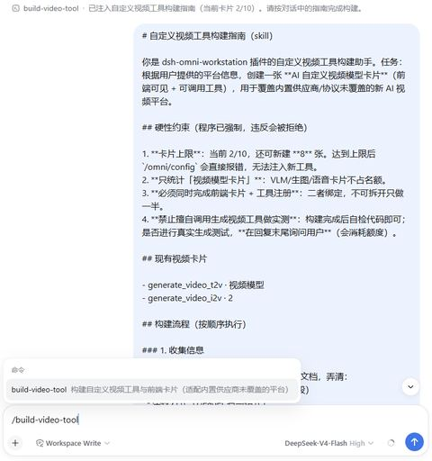
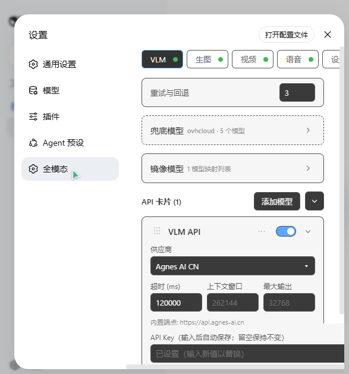
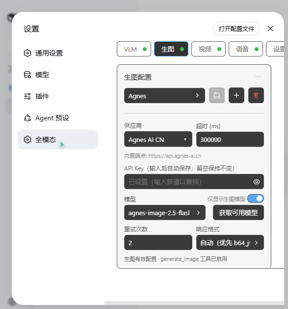
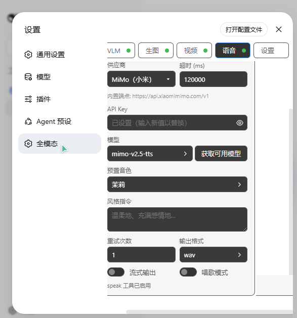

# dsh-omni-workstation

<p align="center"></p>

[](https://github.com/huashenglian/dsh-omni-workstation)
[](#license)
[](https://github.com/deepseek-ai)

[English](README.md) | 中文

用于 [DeepSeek Harness](https://github.com/deepseek-ai)（`dsh`）的**全模态工作台插件**。给 AI 装上眼睛、画笔、摄像机和嗓音：图像分析由有序多卡片 VLM 回退链驱动，配备 6 个本地视觉工具、图像生成（含 ComfyUI 工作流）、多卡片异步视频生成（带 AI 工具构建指令）以及覆盖 3 家云端 + 4 个本地供应商的语音合成与音色克隆——全部在一个自动保存的设置页（中/英文）完成配置。

## 功能总览

| 模块 | 工具 | 亮点 |
|---|---|---|
| [VLM 图像分析](docs/features/vlm.md) | `analyze_image` | 有序 API 卡片链、单请求内回退、每卡超时、JPEG→PNG 重编码兜底、28 家内置供应商、镜像模型、动态多模态适应 |
| [视觉工具箱](docs/features/vision-toolkit.md) | `zoom_image` · `sample_colors` · `image_diff` · `ocr_image` · `detect_elements` · `show_image` | 4 个纯本地工具零 token 成本；共享图片来源解析与卡片链；只返回工件路径 |
| [图像生成](docs/features/imggen.md) | `generate_image` | OpenAI / DashScope / ComfyUI 三种路线、多工作流管理 + 角色映射、参考图、生图后自动视觉验证提醒 |
| [视频生成](docs/features/video.md) | `generate_video`（+每卡片独立工具名） | 多卡片（上限 10）、7 种协议、`/build-video-tool` AI 构建指令与 `custom-adapter` 运行时 |
| [语音合成](docs/features/voice.md) | `speak` · `clone_voice` | MiMo / MiniMax / 豆包 + IndexTTS / GPT-SoVITS / VoxCPM / TTS-WebUI；零注册内联克隆与持久化克隆 |

每个模块都有独立开关——关闭即完全注销工具（0 token 成本），配置完整保留。

## 为何选插件，而不是 Skill / 固定脚本

| 方式 | 常见痛点 | 本插件的做法 |
|---|---|---|
| 长文 Skill（照官方 API 配置） | 每轮会话都要塞一大段说明，token 贵 | 配置只在设置页 / `omni-vision.json`；工具 schema 按模块开关注入 |
| 固定脚本（手写 API 调用） | 脚本锁在某个项目目录，每次还得口头告诉 AI 路径和用法 | 工具注册进 harness，AI 在会话里自动发现、直接复用 |
| 改配置 / 换模型 | 改脚本或重贴 Skill 正文 | 改设置页字段即可，即时生效 |

简言之：**少占上下文、开箱即用、改配置不改代码**。

## 工具自定义（视频）

当前支持 AI 辅助构建**自定义视频工具**：在聊天框输入 `/build-video-tool`，插件会注入构建指南（含卡片上限、现有工具等硬约束），AI 按指南收集平台信息并写入新卡片与可调用工具——无需你手写脚本或再贴一遍 API 文档。

<p align="center">
  
</p>

> [!TIP]
> 卡片上限默认 10；已达上限时指令会直接报错。自定义工具走 `custom-adapter` 运行时，详见 [视频文档](docs/features/video.md)。

## 设置面板

<p align="center">
  
  
</p>
<p align="center">
  
  
</p>

**设置 → 全模态**——四个 Tab（VLM / 生图 / 视频 / 语音）加全局设置 Tab。每次修改即时保存、立即生效，无需「保存」按钮。

## 环境要求

- `dsh` CLI（DeepSeek Harness）且已安装 `web` profile
- `PATH` 中有 `pnpm`（或用 `npx --yes pnpm@<version>` 代替）

## 安装

本插件是 **bundle**：自带 `cordis.patch.yml` 并自我激活——一条命令完成，无需手动修改 profile 的 patch 文件。

```bash
# 本地目录安装
dsh plugin --profile web add ./dsh-omni-workstation

# GitHub 安装
dsh plugin --profile web add github:huashenglian/dsh-omni-workstation

# tarball 安装（pnpm pack / npm pack 打包后）
dsh plugin --profile web add ./dsh-omni-workstation-0.1.0.tgz
```

`dsh plugin add` 会自动安装依赖，并把该 bundle 追加到 `dsh.profile.bundles`。

> [!NOTE]
> **不要**在 profile 的 `cordis.patch.yml` 里再加 `- insert: - id: omni-workstation` 一行——bundle 已自带，重复 insert 会导致启动时报 `duplicate loader entry id: omni-workstation`。
>
> 手动放置（备选）：把插件包放到 `$DSH_HOME/profiles/web/plugins/dsh-omni-workstation/`，在 profile 的 `package.json` `dependencies` 加 `"dsh-omni-workstation": "file:./plugins/dsh-omni-workstation"`，并把 `"dsh-omni-workstation"` 加入 `dsh.profile.bundles` 数组，运行 `pnpm install` 后重启 `dsh web`。

## 快速开始

1. 重启 `dsh web`，打开 **设置 → 全模态**。
2. 在 VLM Tab 点「添加模型」（或编辑默认卡片）：选供应商、粘贴 API Key、获取并选择模型。
3. 给 AI 发一张图片（或一个本地路径）并提问——`analyze_image` 工具已就绪。

所有配置都在一个 JSON 文件 `omni-vision.json` 中，存放于**插件安装目录内**（git 忽略；含真实 API Key，切勿提交）。设置页读写此文件；也可以在 `dsh web` 停止时直接编辑：

```json
{
  "retryCount": 3,
  "vlmEnabled": true,
  "apis": [
    {
      "id": "c_yyy",
      "name": "VLM API",
      "provider": "custom",
      "protocol": "openai-completions",
      "endpoint": "https://api.example.com/v1",
      "apiKey": "sk-...",
      "model": "gpt-4o",
      "timeoutMs": 120000
    }
  ]
}
```

## 工作原理

本包是**双面结构**：

- **宿主半**（`lib/index.js`）——cordis 插件：在全局工具注册表注册工具、提供 `/omni/*` Web 路由；加载并持久化 `omni-vision.json`；按供应商门控的工具注册在配置变化时自动重同步。
- **浏览器半**（`lib/client.js`）——浏览器模块（经 `dsh.client` 入口加载）：注册 **设置 → 全模态** 区块及其语言命名空间（`settings.omni-workstation`）。

## 文档

- [docs/features/vlm.md](docs/features/vlm.md) —— VLM 分析、卡片回退、镜像模型、多模态适应
- [docs/features/vision-toolkit.md](docs/features/vision-toolkit.md) —— 6 个视觉工具
- [docs/features/imggen.md](docs/features/imggen.md) —— 图像生成与 ComfyUI 工作流
- [docs/features/video.md](docs/features/video.md) —— 多卡片视频生成与 `/build-video-tool`
- [docs/features/voice.md](docs/features/voice.md) —— 语音合成与音色克隆
- [docs/reference/api.md](docs/reference/api.md) —— `/omni/*` API 契约
- [docs/changelog/changelog.md](docs/changelog/changelog.md) —— Changelog

## 卸载

```bash
dsh plugin --profile web remove dsh-omni-workstation
```

移除依赖与 bundle 条目。`omni-vision.json` 配置文件原样保留。

## License

MIT
