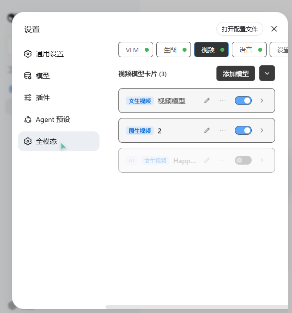

# 视频生成（generate_video）

> [English](../../README.md) | [返回功能索引](../../README.zh.md#功能总览)

视频模块以**多卡片**方式组织：每张卡片注册一个独立工具（默认 `generate_video`），底层是异步任务流水线（提交 → 轮询 → 下载 MP4 到工作区）。支持 7 种协议、9 家供应商预设，并可通过 `/build-video-tool` 斜杠指令让 AI 现场构建自定义视频工具卡片。

## 工具：generate_video（通用卡）

| 参数 | 类型 | 必填 | 说明 |
|---|---|---|---|
| `prompt` | string | 是 | 视频内容提示词（主体、动作、运镜、风格、光线、环境） |
| `image` | string | | 图片路径或公网 URL：i2v 模式作首帧、r2v 模式作参考图、videoedit 模式作参考图 |
| `seconds` | number | | 时长（秒），默认面板初始值 5（上限 30）；用户明确指定时优先 |
| `aspect_ratio` | string | | `16:9` / `9:16` / `1:1` / `4:3` / `3:4` |
| `resolution` | string | | `720p` / `1080p` / `768p`（部分协议支持） |
| `output_dir` | string | | 保存目录；不指定则保存到 `<工作区>/.omni-workstation/videos/` |

DashScope 协议额外参数：`reference_video`（参考/待编辑视频，本地文件自动上传临时存储 48h）、`extra_input` / `extra_parameters`（JSON 字符串浅合并，用于全能模型专属字段）。

返回 `{ ok, path, url, model, protocol, seconds, attempts }`。

## 卡片类型（5 内置 + 自定义）

| type | 工具名 | 模式说明 |
|---|---|---|
| `general` | `generate_video`（只读） | 全能模式：t2v/i2v 由是否传 `image` 决定 |
| `t2v` | `generate_video_t2v` | 文生视频：仅 `prompt`，支持 `ratio` |
| `i2v` | `generate_video_i2v` | 图生视频：`image` 作首帧，输出跟随首帧比例 |
| `edit` | `generate_video_edit` | 视频编辑：`reference_video` 传入待编辑视频 |
| `ref` | `generate_video_ref` | 参考生成：`image` 参考图 + `reference_video` 参考视频 |
| 自定义 | 可编辑 | 类型快照 `{ name, toolName, description }`（v2.12.2，可保存复用） |

## 卡片结构（videoCards[]）

`{ id, name, type, toolName, description, enabled, collapsed, source, config, activePreset }`

- 每卡片独立工具注册：`videoEnabled === true`（默认关，模块开关）且 `enabled !== false` 且配置有效。
- `videoCardLimit`：卡片上限，默认 10、硬顶 10（`videoCardAdd`/`videoCardAddAi` 物理门禁）。
- 共享预设池 `videoPresets[]`（v2.12）：所有卡片共用同一套预设快照，卡片只保留 `activePreset` 引用。
- `source: 'ai'` 为 AI 构建的卡片：头部显示 AI 徽章、不渲染预设栏、toolName 不被 type 推导覆盖。

## 协议（7 种）与供应商

`openai-videos` · `dashscope-video` · `kling-video` · `volc-video` · `minimax-video` · `async-task` · `custom-adapter`

| 供应商 | 协议（固定） | 说明 |
|---|---|---|
| `custom` | 任选 | 任意 Sora 兼容中转站 |
| `agnes` / `agnes-cn` | openai-videos | Agnes Video，经 `/agnesapi` 取片 |
| `dashscope` | dashscope-video | 阿里云百炼 wan 系列；端点可编辑（支持 workspace 专属域名） |
| `kling` | kling-video | 可灵，apiKey 格式 `AccessKey\|SecretKey`（JWT HS256） |
| `volc` | volc-video | 火山方舟 Seedance |
| `minimax` | minimax-video | MiniMax 海螺 |
| `qwen-token-plan` / `qwen-token-plan-cn` | dashscope-video | 通义千问 Token Plan 网关 |

## 卡片配置字段（config）

| 字段 | 默认 | 说明 |
|---|---|---|
| `endpoint` / `apiKey` / `model` | 空 | 端点、Key、模型 |
| `timeoutMs` | `600000` | 请求超时 |
| `pollIntervalMs` | `5000` | 轮询间隔（钳制 1000–60000） |
| `retryCount` | `1` | 重试（≤5） |
| `seconds` / `aspectRatio` / `resolution` | `5` / `16:9` / `720p` | 初始默认值（AI 可按用户要求覆盖） |
| `filterVideoModels` | `true` | 获取模型时按视频关键词筛选 |
| `submitPath` / `pollPath` | `/videos` | async-task 提交/轮询路径 |
| `taskIdField` / `statusField` / `resultField` / `doneStatus` | 空 / `status` / `metadata.url` / `completed` | async-task 字段映射 |
| `adapterCode` | 空 | custom-adapter 的 JS 适配器代码 |

## /build-video-tool 斜杠指令

设置 → 开关扩展 → 视频：`videoBuilderEnabled`（默认开）控制指令是否出现在斜杠菜单。

1. 发送 `/build-video-tool`（可附平台描述）；程序先检测卡片数是否达上限，达上限直接报错不注入。
2. 未达上限则注入 skill 式构建指南（脚手架、`videoCardAddAi` 契约、自检清单），构建知识仅在触发时注入，无常驻 system prompt。
3. AI 通过 `POST /omni/config { videoCardAddAi }` 创建卡片（`source:'ai'`；toolName 需 `^[a-zA-Z][a-zA-Z0-9_]{0,63}$` 且全局唯一）。
4. 用户卡仍走面板「添加模型」模态框手动创建。

## custom-adapter 协议

`adapterCode` 为 JS 对象表达式，实现四函数契约：

- `buildSubmit(args)` → 提交请求（url/method/headers/body）
- `parseTaskId(resp)` → 从提交响应提取任务 id
- `pollUrl(taskId)` → 轮询 URL
- `parseStatus(resp)` → 解析轮询响应为状态（`{ status: 'pending'|'running'|'succeeded'|'failed', progress?, url?, error? }`）

`isVideoConfigValid` 对 custom-adapter 仅要求 endpoint + 合法 adapterCode（model/key 可选）。运行时 `runCustomAdapterVideo` 执行提交/轮询/下载。

## Related

- [README 功能索引](../../README.zh.md#功能总览)
